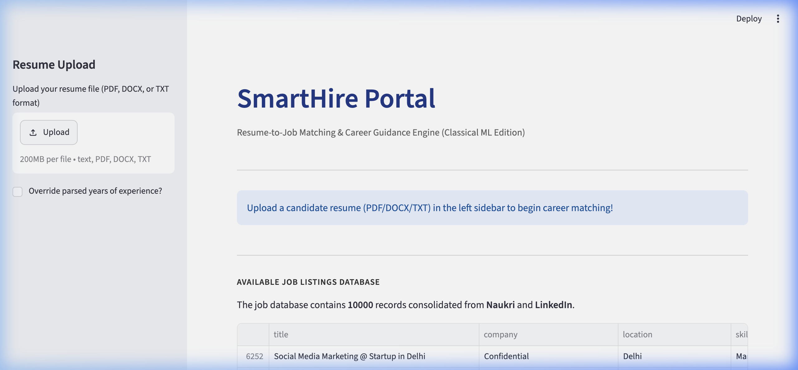
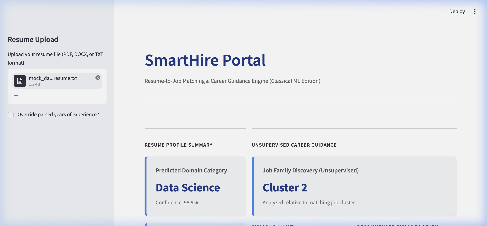

# SmartHire — Resume-to-Job Matching with Classical ML

## What This Is
Hey! This is my final internship project called SmartHire. I built this to solve a real problem: helping students match their resumes to job listings without having to pay for expensive AI APIs or deal with complex LLM setups. It's a simple, self-contained portal that runs entirely on your own laptop.

The app takes a resume in PDF, DOCX, or TXT format and does two main things. First, it predicts the candidate's career domain (like Data Science or Web Development). Second, it searches through a dataset of job postings to find the top 5 matches based on text similarity and skill overlap. It also compares the skills in your resume to the skills that jobs in that domain actually ask for, showing you a list of "skills to learn" so you can patch up any gaps.

I built this project for my internship submission to demonstrate that you can build a useful, end-to-end machine learning pipeline using classical tools. I wanted to show that simple models can still do a lot of heavy lifting when you tweak them right.

## How It Works (Simple Diagram)

Resume PDF → Text Extraction → TF-IDF Vectorization → Classifier (25 job categories)
                                      ↓
                              Cosine Similarity → Job Ranking
                                      ↓
                              Skill Gap Analysis (Jaccard Index)

## Datasets Used
I used three different datasets from Kaggle to build and test the models. You'll need to download them if you want to retrain the models:
* [Resume Screening Dataset](https://www.kaggle.com/datasets/jillanisofttech/updated-resume-dataset) (~960 resumes labeled with 25 categories)
* [Naukri Job Listings](https://www.kaggle.com/datasets/promptcloud/jobs-on-naukricom) (Job postings from India with skills and experience)
* [LinkedIn Job Postings 2024](https://www.kaggle.com/datasets/arshkon/linkedin-job-postings) (Global job descriptions and requirements)

All of these datasets were merged and cleaned manually in `notebooks/01_eda.ipynb`. Some job postings had missing skill fields, which limits the skill-matching granularity, so I had to fallback to extracting skills from raw descriptions in those cases.

## Project Structure
Here's how the files are structured in the repository:

smarthire/
  README.md (This file)
  requirements.txt (Dependencies)
  .gitignore
  data/
    raw/ (Raw Kaggle datasets)
    interim/ (Partially cleaned/merged data)
    processed/ (Final clean datasets)
  notebooks/
    01_eda.ipynb (Data exploration)
    02_resume_classifier.ipynb (Classifier training)
    03_recommender.ipynb (Recommender testing)
    04_clustering_topics.ipynb (Clustering)
    05_fit_predictor.ipynb (Fit predictor)
  src/
    config.py
    data/
      load_data.py
      preprocess.py
    features/
      text_features.py
      match_features.py
    models/
      classifier.py
      recommender.py
      clustering.py
      fit_predictor.py
    parsing/
      resume_parser.py
    evaluate.py
  models/ (Serialized .pkl files)
  app/
    streamlit_app.py (Streamlit UI dashboard)
  reports/
    figures/ (Plots and visualizations)
    final_report.md
  tests/
    test_features.py (Unit tests)

## How to Run
If you want to set this up on your machine, here's how to do it:
1. Clone this repository to your computer.
2. Run `pip install -r requirements.txt` to install the dependencies.
3. Download the raw datasets from Kaggle (using the links in the Datasets section) and place the CSV files inside `data/raw/`.
4. Run the notebooks in order: `01_eda.ipynb` → `02_resume_classifier.ipynb` → `03_recommender.ipynb` → `04_clustering_topics.ipynb` → `05_fit_predictor.ipynb`.
5. Train the models: Just run all cells in each notebook to train and serialize the `.pkl` files.
6. Launch the dashboard by running: `streamlit run app/streamlit_app.py`.
7. Open `http://localhost:8501/` in your browser, upload your resume, and check out the recommendations!

The notebooks take about 10-15 minutes total to run on a standard laptop. The app loads the pre-trained models from disk, so it's fast after the first run.

## What I Learned
* I initially thought TF-IDF with stemming would work, but it broke technical terms like 'Python' and 'JavaScript' into nonsense. I switched to lemmatization instead and kept bigrams so that terms stayed readable.
* The classifier does good on clear categories, but class imbalance was a bigger problem than I expected. The 'Data Science' category had over 200 samples but some categories had under 30. I had to use `class_weight='balanced'` in the Logistic Regression model to make it fair.
* The skill extractor was definitely the hardest part. Regex matching is super brittle because things like 'Scikit-learn' vs 'sklearn' vs 'scikit learn' all need to point to the same skill. I ended up building a dictionary with aliases to resolve them.
* Calibrating the classifier was necessary. Without it, the model was overconfident (99% on everything) or underconfident (15%). I used Platt scaling (`CalibratedClassifierCV`) which made the confidence scores look way more reasonable.

## Limitations & Future Work
* The experience parser uses regular expressions to find years, so it misses non-standard formats. That's why I added a manual override slider in the sidebar.
* The job dataset skill tagging is incomplete. Since many postings don't list structured skills, the skill-gap analysis is based on the job cluster profile instead of individual job requirements.
* TF-IDF captures simple word overlap but doesn't understand semantic meaning. Things like 'Machine Learning' and 'ML' match, but 'Data Science' and 'Analytics' might not align as well as they should.
* Future work: I want to try sentence-transformer embeddings to improve semantic matching, add a proper fit predictor trained on real applicant-job pairs, and expand the skills dictionary to support 500+ terms.

## Tech Stack
* Python 3.9
* scikit-learn
* pandas, numpy
* matplotlib, seaborn
* streamlit
* pdfplumber, python-docx
* nltk

## Screenshots

*App interface showing resume upload page*

*App interface showing parsed results and job recommendations*

## Acknowledgments
* Datasets from Kaggle contributors.
* Built as part of my final internship submission.

Feel free to open an issue if something breaks. I'm still learning too.
